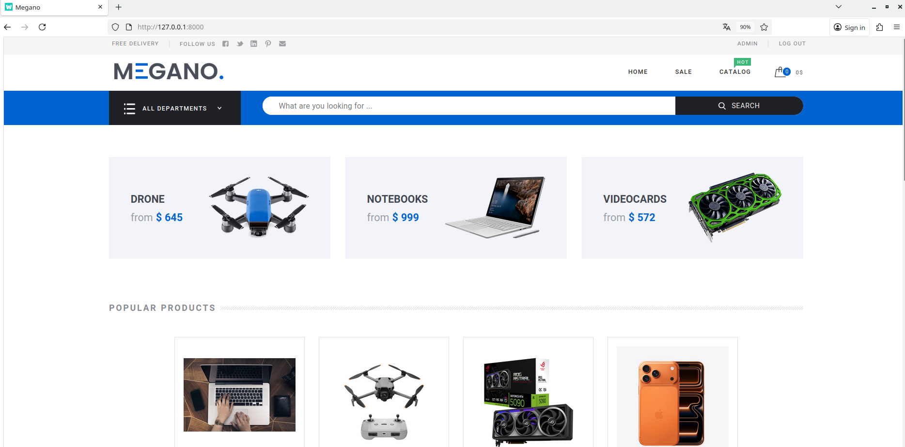

 
Megano — a full-stack e-commerce application built as part of a diploma project.   
It includes a Django backend and a Vue.js frontend, providing a complete shopping experience. 
 
--- 
 
## 🚀 Features 
- Product catalog with categories and filters   
- Shopping cart and order creation   
- Checkout and order confirmation flow   
- User authentication and profiles   
- Admin panel for managing products and users   
- REST API with Swagger documentation 
 
--- 
 
## 🧠 Technologies Used 
- Backend: Python, Django, Django REST Framework
- Database: SQLite   
- API Documentation: Swagger / DRF schema   
- Version Control: Git & GitHub   
 
--- 
 
## 🗂 Project Structure diploma_project/ 
├── catalog/         # Product models, views, serializers \
├── orders/          # Cart and order logic \
├── users/           # Authentication and profiles \
├── megano/          # Project configuration \
├── media/           # Uploaded images \
├── requirements.txt # Dependencies \
└── README.md        # Project overview 
 
---
## 🖼️ Screenshot



--- 
 
## 🧩 Installation 
1. Clone the repository: 
```
     git clone https://github.com/MeloRegon/Megano.git 
```   
2. Navigate to the project folder: 
```
    cd Megano 
```    
3. Install dependencies: 
```  
    pip install -r requirements.txt 
```   
4. Run migrations: 
```
    python manage.py migrate 
```    
5. Start the development server: 
```
    python manage.py runserver 
```    
 
## 🔗 Links 
- GitHub: [MeloRegon](https://github.com/MeloRegon)
 
--- 
